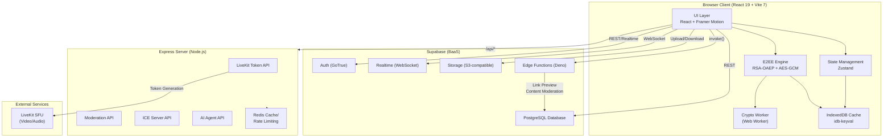
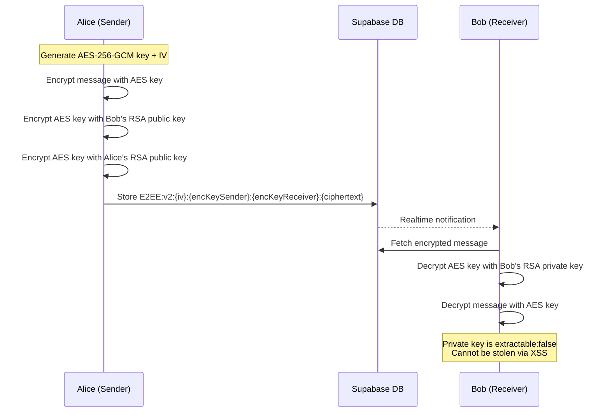

# SkillSwap — Architecture Overview

> Last updated: April 2026

## 🏗️ High-Level Architecture



## 📊 Service Responsibility Matrix

| Component | Location | Responsibility | Why Here? |
|-----------|----------|---------------|-----------|
| **Authentication** | Supabase Auth | User login, OAuth, session management | Managed service, built-in RLS integration |
| **Database** | Supabase PostgreSQL | Users, messages, conversations, public keys | Managed with RLS policies, real-time capable |
| **Real-time Messaging** | Supabase Realtime | Live message delivery, typing indicators, presence | WebSocket channels with auth integration |
| **Encrypted Media Storage** | Supabase Storage | AES-GCM encrypted images/audio blobs | S3-compatible, integrates with RLS |
| **Link Previews** | Supabase Edge Functions | Fetch OG metadata, phishing check | Server-side fetch avoids CORS/XSS, low latency |
| **LiveKit Tokens** | Express Server | Generate authenticated video call tokens | Requires `LIVEKIT_API_SECRET` — must never reach client |
| **Rate Limiting** | Express + Redis | Throttle API requests per IP/user | Redis for distributed counting, Express middleware |
| **Content Moderation** | Express Server | AI-powered message/image moderation | Server-side processing with GPU/API access |
| **ICE Servers** | Express Server | Provide TURN/STUN credentials | Dynamic credential rotation |
| **E2EE Encryption** | Browser (Web Crypto API) | RSA-OAEP + AES-GCM hybrid encryption | Keys never leave the client, `extractable: false` |
| **Crypto Worker** | Browser (Web Worker) | Offload decryption from UI thread | Prevents frame drops during batch decryption |

## 🔒 E2EE Architecture



### Key Storage
- **Public Keys**: Stored in `user_public_keys` table (Supabase)
- **Private Keys**: Stored in IndexedDB with PBKDF2 password encryption
- **Private Key CryptoKey**: Imported with `extractable: false` — cannot be exported even with XSS

## 📁 Project Structure (Feature-Sliced Design)

```
src/
├── App.tsx                     # Root component + routing
├── main.tsx                    # Entry point
├── index.css                   # Global styles
│
├── components/                 # Shared UI components
│   └── ui/
│       └── core/               # Button, ErrorBoundary, etc.
│
├── context/                    # React contexts (Auth, Theme)
│
├── features/                   # Feature-Sliced modules
│   ├── chat/                   # 💬 Messaging system
│   │   ├── components/
│   │   │   ├── atoms/          # Small UI pieces
│   │   │   ├── molecules/      # MessageBubble, LinkPreviewCard
│   │   │   └── organisms/      # MessageItem, ChatWindow
│   │   ├── hooks/              # useChat, useSendMessage, useLinkDetection
│   │   ├── services/           # crypto.ts, crypto.worker.ts, cryptoWorkerManager.ts
│   │   ├── store/              # Zustand chat store
│   │   ├── types/              # TypeScript interfaces
│   │   └── utils/              # Chat-specific utilities
│   │
│   ├── avatar/                 # 🧑‍🎨 3D Avatar system (Three.js)
│   ├── calls/                  # 📞 Video/Voice calls (LiveKit)
│   ├── chess/                  # ♟️ Chess game
│   ├── code-editor/            # 💻 Monaco code editor
│   ├── screen-share/           # 🖥️ Screen sharing
│   ├── video-pinning/          # 📌 Video pinning
│   ├── watch-mode/             # 👀 Watch mode
│   └── whiteboard/             # 🎨 Collaborative whiteboard
│
├── hooks/                      # Global hooks
├── lib/                        # Supabase client, utilities
├── pages/                      # Route pages
├── services/                   # Global services
├── styles/                     # CSS modules
└── utils/                      # Shared utilities

server/
├── index.ts                    # Express entry point
├── config/                     # Environment config
├── middleware/                 # Rate limiters, auth
├── routes/                     # API routes
│   ├── livekit.routes.ts       # LiveKit token generation
│   ├── agent.routes.ts         # AI agent API
│   ├── moderation.routes.ts    # Content moderation
│   └── ice.routes.ts           # ICE/TURN credentials
├── services/                   # Business logic
└── utils/                      # Logger, helpers

supabase/
└── functions/                  # Edge Functions
    └── fetch-link-preview/     # OG metadata + phishing check
```

## 🚀 Performance Strategy

### Lazy Loading
All heavy features are loaded on-demand via `React.lazy`:
- `VideoChatPage` — LiveKit + 3D avatars
- `ProfilePage`, `SettingsPage`, `MessagesPage`
- `AdminDashboard`

### Bundle Splitting (manualChunks)
| Chunk | Contents | Loaded When |
|-------|----------|-------------|
| `vendor-react` | React, ReactDOM, React Router | Always (initial) |
| `vendor-ui-motion` | Framer Motion, Lucide, clsx | Always (initial) |
| `vendor-3d` | Three.js, R3F, Drei | Video chat page |
| `vendor-livekit` | LiveKit client + components | Video chat page |
| `vendor-supabase` | Supabase JS client | Always (initial) |
| `vendor-chat` | idb-keyval, browser-image-compression | Messages page |
| `vendor-state` | Zustand | Always (initial) |

### Crypto Worker
- Decryption runs in a dedicated Web Worker to prevent UI jank
- LRU cache (500 entries, 5min TTL) inside the Worker avoids redundant operations
- Automatic fallback to main thread if Worker initialization fails
