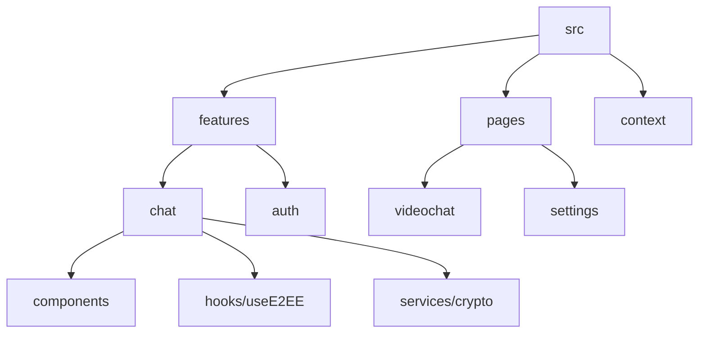

# ⚡ SkillSwap: The Encrypted P2P Skill Exchange


**SkillSwap** is a next-generation peer-to-peer (P2P) platform designed for secure, anonymous, and high-performance skill exchange. Built with a **Cybersecurity-First** mindset, it empowers learners and experts to connect via encrypted channels, ensuring that knowledge is shared without compromising privacy.

---

## 🛡️ Cybersecurity & Privacy Architecture

SkillSwap is engineered to exceed modern privacy standards. Our architecture implements multiple layers of defense:

### 1. End-to-End Encryption (E2EE)
- **Asymmetric Encryption**: Every user generates a unique RSA-2048 key pair upon registration.
- **Private Key Sovereignty**: Private keys are encrypted with the user's password using **AES-256-GCM** before being backed up. SkillSwap never has access to plain-text private keys.
- **Signal Security**: All message payloads and call signals are encrypted with the recipient's public key, ensuring that even database administrators cannot read conversations.

### 2. Multi-Path Audio Stripping
- During voice calls, audio data is split into multiple parallel streams.
- **Camo-Noise Injection**: One stream contains the real audio, while others carry amplitude-matched white noise to camouflage the actual voice signal against sophisticated packet sniffing.

### 3. AI-Driven Zero-Trust Moderation
- **Real-time Image Moderation**: Automated AI scanners monitor video streams for inappropriate content without storing images.
- **Panic Mode (Self-Destruct)**: A specialized "Panic Wipe" feature (Hotkey: `Ctrl+Shift+P`) allows users to instantly purge all local and session-based cryptographic keys, geographic fingerprints, and active sessions. This provides a critical layer of defense against **Physical Threats** or coerced access.

---

## 🏗️ Technical Architecture (Feature-Based)

The project follows a **Feature-Based Module System**, promoting extreme scalability and maintainability:



- **Modular Features**: Each feature (Chat, Auth, Video) is self-contained with its own logic, hooks, and UI components.
- **Context Injection**: Global states like `SecurityContext` and `AuthContext` provide a unified source of truth across the application.
- **PWA Optimized**: Support for "Add to Home Screen" with offline-ready manifest and high-performance caching.

---

## 🚀 Key Features

- **Crystal Clear Video Chat**: Optimized for low-latency learning sessions.
- **Interactive Workspace**: Shared 3D Chess, Whiteboard, and Code Editor for hands-on collaboration.
- **Security Dashboard**: Live indicators for AES-256 strength, multi-path active status, and human voice verification.
- **Global P2P Network**: Instant matching with users worldwide based on skill interests.

---

## 🛠️ Stack & Technologies

- **Frontend**: React 18, Vite, TypeScript, Tailwind CSS 4.0.
- **Animations**: Framer Motion (Organic spring transitions).
- **Backend/Realtime**: Supabase (PostgreSQL, Realtime, Auth, Storage).
- **Icons**: Lucide-React (Optimized tree-shaking).
- **Security**: SubtleCrypto API, RTCDataChannel, JWT.

---

## 🎓 Academic Credit
This project was developed as a flagship demonstration of **Advanced Web Engineering** and **Cybersecurity Implementation** at **Jordan University of Science and Technology (JUST)**.

Developed by **Antigravity AI** in collaboration with the user.

---

## 📝 Installation

1. Clone the repository:
   ```bash
   git clone https://github.com/your-repo/skill-swap.git
   ```
2. Install dependencies:
   ```bash
   npm install
   ```
3. Run the development server:
   ```bash
   npm run dev
   ```

---

*“Swap what you know for what you want to learn. Securely.”*
